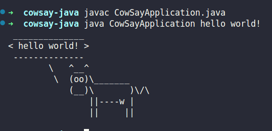

## Cow say in Java

## What is the project?

A simple clone of cowsay program, where you can pass a message to a cow say lol !!

### How run this fun project?

Requirements:

- Java (I use 21 version)

1. Clone this project or download zip and extract.

```
git clone url_project
```

2. Compile CowSayApplication.java

```
javac CowSayApplication.java
```

3. Run .class bytecode with you own message

```
java CowSayApplication your_message
```

### Visual Example


